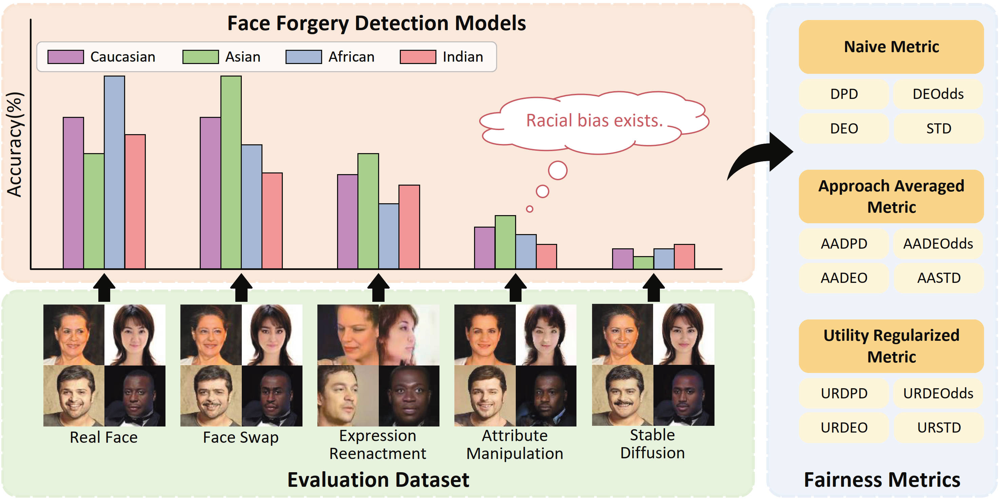
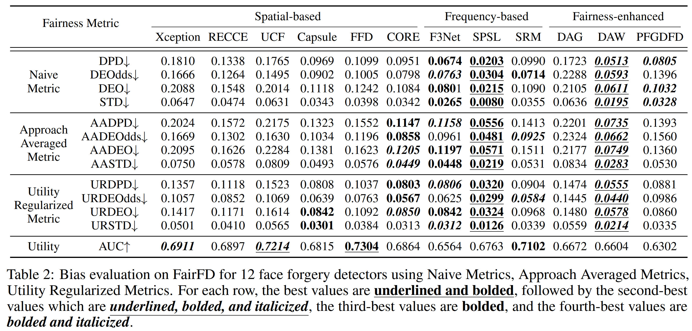
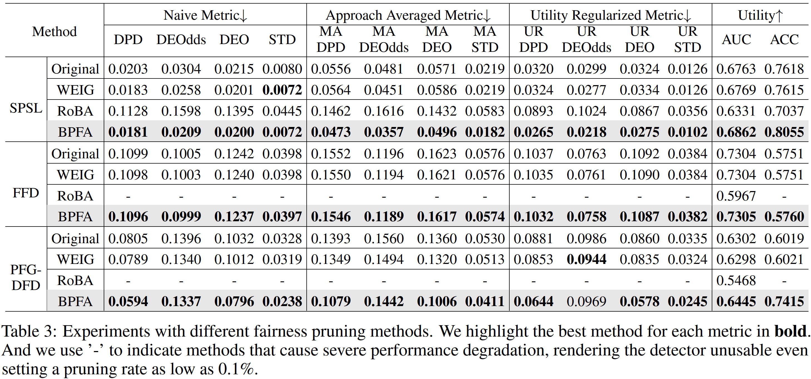

# Thinking Racial Bias in Fair Forgery Detection: Models, Datasets and Evaluations

[](https://arxiv.org/abs/2407.14367)




This is the official project repository for the paper ["Thinking Racial Bias in Fair Forgery Detection: Models, Datasets and Evaluations"](https://arxiv.org/abs/2407.14367v2) (AAAI 2025). This paper proposes a fairness evaluation dataset for deepfake detection, along with a pruning-based method to enhance fairness.


## 🎁 Get our FairFD dataset

<!-- Please click this [Link](https://mailstsinghuaeducn-my.sharepoint.com/:f:/g/personal/zq-wang24_mails_tsinghua_edu_cn/EvaLlK_b1PpAgDIIoxHb34YBMLPEKlC5FxvQAviO221uCA?e=OcVNzp) to access our dataset and pretrained weights. The FairFD dataset is available for non-commercial research purposes only. FairFD is built upon RFW, so please also follow the [RFW's license](http://whdeng.cn/RFW/Training%EF%BC%88%E6%AD%A3%E5%BC%8F%E7%89%88%EF%BC%89/license.html). -->

https://docs.google.com/forms/d/1N4SN2D6YLFhji505nn9K1pQTupJhJMJmmQuJzilbxAs/viewform?edit_requested=true

After downloading, organize the directory structure as follows:

```
dataset
├── test
|   ├── FaceSwap
|   │   ├── African
|   │   │   └── *.jpg
|   │   ├── Asian
|   │   │   └── *.jpg
|   │   ├── Caucasian
|   │   │   └── *.jpg
|   │   ├── Indian
|   │   │   └── *.jpg
|   ├── SimSwap
|   │   ├── African
|   │   │   └── *.jpg
|   │   ├── Asian
|   │   │   └── *.jpg
|   │   ├── Caucasian
|   │   │   └── *.jpg
|   │   ├── Indian
|   │   │   └── *.jpg
|   ├── ...
weights
├── xception.pth
├── ucf.pth
├── *.pth
Fairness-Benchmark-for-Face-Forgery-Detection (This repository)
└── code(*.py/.ipynb)
```

## ⏳ Quick Start

### 1. Installation

You need to set up the Conda or Docker environment. You can build the environment by following this [Link](https://github.com/SCLBD/DeepfakeBench?tab=readme-ov-file#-quick-start). Please remember to download the pretrained weights into the [`./pretrained`](./pretrained) folder.

After downloading the necessary files, kindly organize the directory structure as outlined in [Get our FairFD dataset](#-get-our-fairfd-dataset).

### 2. Get confidence scores

After successful installation, you can run the following scripts to obtain the confidence scores for the provided model. 

```bash
# For normal models
python test-get-confidence.py \
--detector_path="./config/detector/xception.yaml" \
--weights_path="../weights/xception.pth"

# For fairness trained models
python test-get-confidence-fairness-enhanced.py \
--detector_path="./config/detector/pfgdfd.yaml" \
--weights_path="../weights/pfgdfd.pth"
```

### 3. Get benchmark results

Please follow our step-by-step notebook [`calculate_benchmark.ipynb`](calculate_benchmark.ipynb) to compute the final metrics based on the previous confidence scores.

## 🏆 Benchmark Results



## 🎯 New SOTA with our Bias Pruning with Fair Activations (BPFA)

### Conduct pruning
We provide step by step notebooks [`pruning_pipeline.ipynb`](pruning_pipeline.ipynb) for normal models and [`pruning_pipeline-fairness-enhanced.ipynb`](pruning_pipeline-fairness-enhanced.ipynb) for fairness trained models to conduct pruning. 

### Results




## 🏷️ Citation

If FairFD or BPFA is useful for your research, please consider citing the following paper: 

```bibtex
@article{liu2024thinking,
  title={Thinking Racial Bias in Fair Forgery Detection: Models, Datasets and Evaluations},
  author={Liu, Decheng and Wang, Zongqi and Peng, Chunlei and Wang, Nannan and Hu, Ruimin and Gao, Xinbo},
  journal={arXiv preprint arXiv:2407.14367},
  year={2024},
  url={https://arxiv.org/abs/2407.14367}
}
```

## Acknowledgement

We acknowledge the use of dataset, code and some weights from https://github.com/SCLBD/DeepfakeBench (NeruIPS 2023) and code from https://github.com/Purdue-M2/AI-Face-FairnessBench. If you cite our paper, please consider citing their paper as well:

1. Yan, Zhiyuan, Yong Zhang, Xinhang Yuan, Siwei Lyu, and Baoyuan Wu. "DeepfakeBench: a comprehensive benchmark of deepfake detection." In Proceedings of the 37th International Conference on Neural Information Processing Systems (NeurIPS), 2023.
2. Lin, Li, Xin Wang, and Shu Hu. "AI-Face: A Million-Scale Demographically Annotated AI-Generated Face Dataset and Fairness Benchmark." arXiv preprint arXiv:2406.00783 (2024).
3. Wang, Mei, Weihong Deng, Jiani Hu, Xunqiang Tao, and Yaohai Huang. "Racial faces in the wild: Reducing racial bias by information maximization adaptation network." In Proceedings of the ieee/cvf international conference on computer vision (ICCV), 2019.


